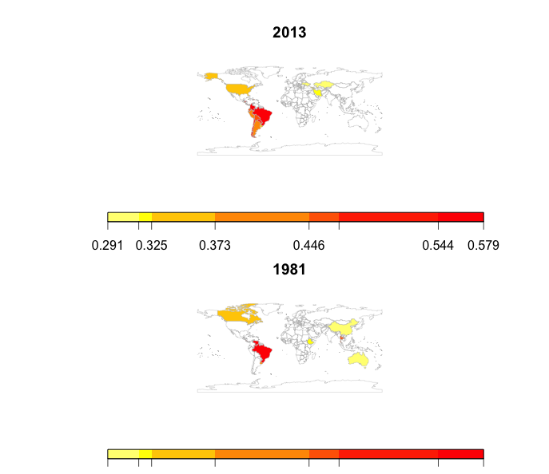
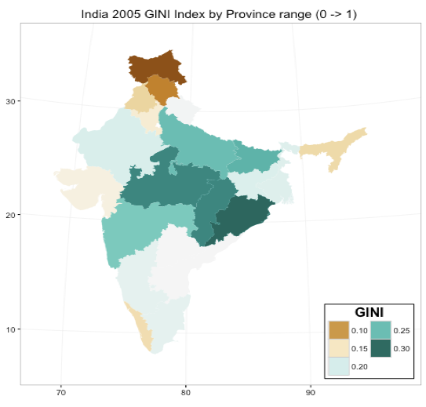

```{r, eval=TRUE, include=FALSE}
library(ineq)
library(rgdal)        # for readOGR(...)
library(RColorBrewer) # for brewer.pal(...)
library(data.table)
library(maptools)
library(maps)
library(ggplot2)
library(ggthemes)
library(graphics)
library(jsonlite)
library(tigris)
library(tidyr)
library(dplyr)
library(RCurl)
library(rworldmap)
```

##Introduction: 
Income inequality has become a topical discussion in recent years as matters of growth and social welfare of countries receive 
greater scrutiny.  Globalization and its relationship to wealth and poverty concentration underlies much of this heightened interest 
in income dispersion.  Before drawing inferences regarding this phenonomenon, its is helpful to first provide context by looking
at research in the area and doing a bit of data analysis.

Lets start with how income inequality is commonly measured by economists.  The GINI coefficient is an internationally recognized measure 
of income dispersion which is widely used by economists and social scientists.  It was developed as a ratio of idealized "perfect" to 
"observed" equality and graphically is illustrated by the difference in area between these curves to the area under the ideal curve.  The 
GINI ratio is derived from the Lorenz curve developed by Max O. Lorenz in 1905 for representing inequality of the wealth distribution. 

This fundamental model seems to be a good fit for analysis of variance modeling but visualizing this distribution perhaps is a more compelling 
way to convey what is happening between and within countries.

https://en.wikipedia.org/wiki/Lorenz_curve

##The Lorenz Curve
```{r, eval=TRUE}
# an simple example of the Lorenz curve model
bndry <- c( A=137, B=499, C=311, D=173, E=219, F=81)
bndry <- Lc(bndry, n = rep(1,length(bndry)), plot =F)
plot(bndry,col="black",lty=1,lwd=3,main="Lorenz Curve",xlab="Cum % of population", ylab="Cum % of income")
```

##Fallacy of Composition
The false assumption that what is true for the part is necessarily true for the whole.

In the context of this analysis we should look at income inequality between countries over time and then
look at some representative countries and the inequality within.  Knowing what the actual trends are over 
time may help to clarify what is happening.

Finally, we will develop a narrative based upon observations and inferences of what is happening.

##What is the income inequality trend globally?
It is a myth that global income inequality is increaseing [Sali-Martin]  
 
 

##Global Analysis from the World Bank
We download worldbank data and subset it so that it will include GINI coefficients only for 2005 and 2013. 
Because the GINI coefficient for 2005 for India is missing, the idea of the previous chunk was to scrape the 
urban and rural GINI coefficients for India and compute the weighted GINI coefficient and replace the NA for 
2005 for India with that value.

```{r, eval=TRUE}
worlddata = subset(read.csv(text = 
    getURL("https://raw.githubusercontent.com/cyadusha/Popular-indicators/master/55e42714-cbf5-42ee-9995-eed3fc8d3102_Data.csv"), sep = ","), 
    select = c(Country.Name, X1981..YR1981., X2013..YR2013.))
colnames(worlddata)[1] = "Country Name"
colnames(worlddata)[2] = "1981GINI"
colnames(worlddata)[3] = "2013GINI"
worlddata = worlddata[1:214,]
worlddata$`1981GINI` = as.numeric(as.vector(worlddata$`1981GINI`))
worlddata$`2013GINI` = as.numeric(as.vector(worlddata$`2013GINI`))
worlddata$`1981GINI` = as.vector(worlddata$`1981GINI`/100)
worlddata$`2013GINI` = as.vector(worlddata$`2013GINI`/100)
n = joinCountryData2Map(worlddata, joinCode="NAME", nameJoinColumn="Country Name")
#par(mfrow=c(2,1))
#plot2 = mapCountryData(n, nameColumnToPlot="2013GINI", mapTitle = "2013", addLegend = F)
#do.call(addMapLegend, c(plot1, legendLabels="all", legendIntervals="data", legendMar = 2 ))
#plot1 = mapCountryData(n, nameColumnToPlot="1981GINI", mapTitle = "1981", addLegend = F)
#do.call(addMapLegend, c(plot1, legendLabels="all", legendIntervals="data", legendMar = 2 ))

```
##Global GINI 1981 vs 2013
 


```{r, eval=TRUE,include=FALSE}
setwd("~/IS607Spring2016/project-final")
dat.india.url = "http://knoema.com/api/1.0/data/wiwuiff"
dat.india.parms =
"?Time=2005-2005&region=1000130,1000020,1000040,1000050,1000060,1000080,1000090,1000100,1000110,1000120,1000140,1000150,1000160,1000220,1000210,1000230,1000290,1000280,1000270,1000250&variable=1000130,1000140,1000070,1000080&Frequencies=A"
dat.india.query = paste0(dat.india.url,dat.india.parms)
dat.india.province = fromJSON(dat.india.query)
dat.india.province = subset(dat.india.province$data, select = -c(Unit, Time, RegionId, Frequency, Scale))
dat.india.province = data.frame(spread(dat.india.province, variable, Value))
colnames(dat.india.province)[2:5] = c("PercentageRural", "PercentageUrban", "RuralGini", "UrbanGini")
dat.india.province$region[8] = "Jammu and Kashmir"
dat.india.province$region[14] = "Odisha"
 
dir.ind.regions.shpfiles <- paste0(getwd(),"/ind-files/IND_adm_shp")
map.ind.regions1 <-
readShapePoly(paste0(dir.ind.regions.shpfiles,"/IND_adm1.shp"),
proj4string=CRS("+proj=longlat +datum=NAD27"))
 
dat.india.province <- rbind(dat.india.province, data.frame(region = 'Telangana', subset(dat.india.province, region == "Andhra Pradesh", select = -c(region))))
dat.india.province <- dat.india.province[order(dat.india.province$region),]
#Recalc overall average per province as weighted average of rural and urban populations.
dat.india.province$GINI <- (
      (dat.india.province$RuralGini)*(dat.india.province$PercentageRural) +
      (dat.india.province$UrbanGini)*(dat.india.province$PercentageUrban)
)/100
 
dat.india.url = "http://knoema.com/api/1.0/data/wiwuiff"
dat.india.parms = "?Time=2005-2005&variable=1000130,1000140,1000080,1000070&region=1000000&Frequencies=A"
dat.india.query = paste0(dat.india.url,dat.india.parms)
dat.india = fromJSON(dat.india.query)
dat.india = subset(dat.india$data,select = -c(Unit, Time, RegionId, Frequency, Scale))
dat.india = data.frame(spread(dat.india, variable, Value))
colnames(dat.india)[2:5] = c("PercentageRural", "PercentageUrban", "RuralGini", "UrbanGini")
dat.india$GINI = ((dat.india$RuralGini)*(dat.india$PercentageRural) + (dat.india$UrbanGini)*(dat.india$PercentageUrban))/100
 
map.ind.regions1 = fortify(map.ind.regions1, region = "NAME_1")
map.ind.regions1 = rename(map.ind.regions1,x=long,y=lat)
 
mycolors = brewer.pal(9,"BrBG")
```

## ggplot mapping GINI data to India's Provinces
```{r, eval=FALSE, include=TRUE}
gi <- ggplot(data=dat.india.province) +
      scale_fill_gradientn(name="Coverage", colours = mycolors)
gi <- gi + geom_map(
                map=map.ind.regions1,
                aes(fill=GINI, map_id=region)
  ) +
  expand_limits(map.ind.regions1) +
  theme_bw()
gi <- gi + coord_map("polyconic") +
      labs(title="India 2005 GINI Index by Province range (0 -> 1) ",x="",y="") +
      theme_bw() +
      theme(legend.justification=c(1,0),legend.position=c(1,0),
            legend.background=element_rect(colour="black"))
gi <- gi + guides(fill=guide_legend(title="GINI",nrow=3,title.position="top",
                title.hjust=0.5,title.theme=element_text(face="bold",angle=0)))
gi <- gi + scale_x_continuous("") + scale_y_continuous("")
gi 
```

##India
Non-OECD countries in S.E. Asia show a rise in income inequality as wealth increases
 

##The United States, as a representative OECD country and its pattern of income inequality.
The Census Bureau publishes data sets which track the GINI index at different levels of geographic granularity including 
region, state, congressional district and metropolitan statical area.  This study analyzes the income dispersion within the 
United States using Census data and in particular, income data collected for the American Community Survey.  The Census Bureau 
provides the followng tool for acquiring data sets . . .

http://factfinder.census.gov/faces/nav/jsf/pages/guided_search.xhtml

##Data:
This is an observational study of data collected by surveyors by the US Census Bureau.  The presumption is that each observation 
is an independent event of objective fact.  The Census Bureau's survey techniques rely sampling, so the initial data-set is based 
to a degree on statiscial inference and imputed data. 

##Details1
All data used in this survey was sourced from the American Community Survey published by the US Census Bureau.  4 distinct 
datasets generated using the Census Bureau's utility.  Except for the Regional data set all other data sets have more than 
30 independent observations.  It is therefore expected that a near normal sampling distribution applies to the data collected. 
    
    * Gini Indicies by Region
    * Gini Indicies by State
    * Gini Indicies by Congressional District
    * Gini Indicies by Metropolitan Statistical Area  

##Details2
The following cases correspond to each geographic level data set above:
      
    *   4 Regions:  Northeast, Midwest, South and West + US Oveall 
    *  50 States
    * 436 Congressional Districts
    * 916 Gini Indicies by Metropolitan Statistical Area 

##
 

##


##
Congressional Districts show a concentration of income within states based upon political boundaries 

