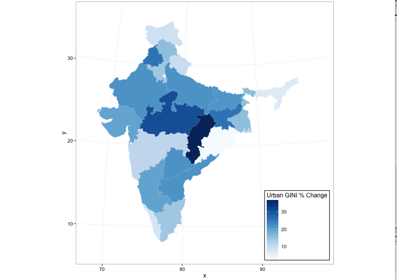
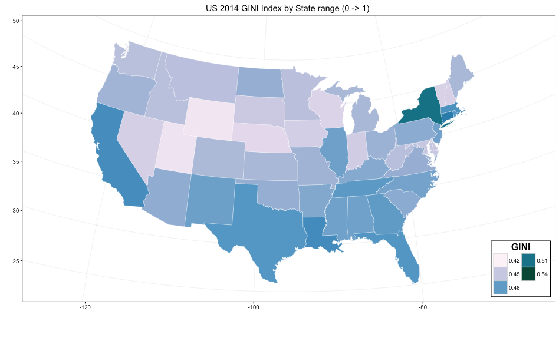

```{r-load-libraries, eval=TRUE, include=FALSE}
setwd("~/IS607Spring2016/project-final")
library(ineq)
library(rgdal)        # for readOGR(...)
library(RColorBrewer) # for brewer.pal(...)
library(data.table)
library(maptools)
library(gpclib)
library(maps)
library(ggplot2)
library(ggthemes)
library(graphics)
library(grid)
library(gridExtra)
library(jsonlite)
library(tigris)
library(tidyr)
library(dplyr)
library(httr)
library(RCurl)
library(rworldmap)
library(Quandl)
library(RPostgreSQL)
```

##Demystifying Inequality
Income inequality has become a topical discussion in recent years as growth and social welfare matters for countries receive 
greater scrutiny.  Globalization and its relationship to wealth and poverty underlie much of this heightened interest.  Before 
drawing inferences regarding inequality, its is helpful to first provide context by looking at research in the area and analyzing 
what this phenomenon is telling us.

Let's start with how income inequality as it is commonly measured by economists.  The GINI coefficient is an internationally recognized 
measure of income dispersion which is widely used by economists and social scientists.  It was developed as a ratio of idealized "perfect" 
to "observed" equality and graphically is illustrated by the difference in area between these curves to the area under the ideal curve.  
The GINI ratio is derived from the Lorenz curve developed by Max O. Lorenz in 1905 for representing inequality of the wealth distribution. 

This fundamental model seems to be a good fit for analysis of variance modeling but visualizing this distribution perhaps is a more compelling 
way to convey what is happening between and within countries.

https://en.wikipedia.org/wiki/Lorenz_curve

##The Lorenz Curve
```{r, eval=TRUE}
# an simple example of the Lorenz curve model
bndry <- c( A=137, B=499, C=311, D=173, E=219, F=81)
bndry <- Lc(bndry, n = rep(1,length(bndry)), plot =F)
plot(bndry,col="black",lty=1,lwd=3,main="Lorenz Curve",xlab="Cum % of population", ylab="Cum % of income")
```

##Fallacy of Composition
A misperception that what is true for the part is necessarily true for the whole.

In the context of inequality what is true within countries over time is not necessarily true between countries.
By analyzing representative countries this study provides a visualization of this distinction.  

Inferences can then be drawn from this analysis to give us a narrative as to what is happening with inequality.

##Cavaets regarding Data and Resuable Code
This study references "Parametric Estimations of the World Distribution of Income"
Maxim Pinkovskiy, Massachusetts Institute of Technology
Xavier Sala-i-Martin, Columbia University and NBER1 Oct 11, 2009

Global and India data sets and shape files were sourced from the World Bank.  Many data sets that would be needed to
make this a more complete analysis was not available--at least publically.  Missing data is therefore noted and due to 
processing and time contraints required to render shapefiles, we show pre-rendered maps as png files, thus the code 
is not completely reproducable.

US data sets and shape files were sourced from the US Census Bureau

##Decreasing Inequality between Countries
Global trends actually show a decrease in inequality between countries over the past 40 years as Non-OECD
countries develop economically to parity with OECD countries.  Where the inequality is increasing within
many developing countries as concentrations of wealth grow where there had been widespread poverty.
[6 myths - Sali-Martin](https://www.youtube.com/watch?v=W17A-jiyDCw)  

#THE GLOBAL OUTLOOK

## Global income inequality is Diminishing 
 
 
[Maxim Pinkovskiy & Xavier Sala-i-Martin 2009] 

##Global Analysis from the World Bank
We download worldbank data and subset it so that it will include GINI coefficients only for 1981 and 2013. 
Because the GINI coefficient for 2005 for India is missing, the idea of the previous chunk was to scrape the 
urban and rural GINI coefficients for India and compute the weighted GINI coefficient and replace the NA for 
2005 for India with that value.

```{r, eval=TRUE, include=FALSE}
#Now, we download the worldbank data and subset it so that it will include GINI coefficients only for 1981 and 2013.
worlddata = 
  subset(
          read.csv(text = getURL("https://raw.githubusercontent.com/cyadusha/Popular-indicators/master/55e42714-cbf5-42ee-9995-eed3fc8d3102_Data.csv"), 
          sep = ","), select = c(Country.Name, X1981..YR1981., X2013..YR2013.)
  )
colnames(worlddata)[1] = "Country Name"
colnames(worlddata)[2] = "1981GINI"
colnames(worlddata)[3] = "2013GINI"
worlddata = worlddata[1:214,]
worlddata$`Country Name` = as.character(worlddata$`Country Name`)
worlddata$`1981GINI` = as.numeric(as.vector(worlddata$`1981GINI`))
worlddata$`2013GINI` = as.numeric(as.vector(worlddata$`2013GINI`))
worlddata$`1981GINI` = as.vector(worlddata$`1981GINI`/100)
worlddata$`2013GINI` = as.vector(worlddata$`2013GINI`/100)


#We also rename some of the countries listed because they contain commas and parentheses. After this is done, we arrange all of the countries 
#in alphabetical order.
worlddata$`Country Name`[which(worlddata$`Country Name` == "Korea, Dem. People's Rep.")]  = "North Korea"
worlddata$`Country Name`[which(worlddata$`Country Name` == "Korea, Rep.")]  = "South Korea"
worlddata$`Country Name`[which(worlddata$`Country Name` == "Congo, Dem. Rep.")] = "Democratic Republic of the Congo"
worlddata$`Country Name`[which(worlddata$`Country Name` == "Hong Kong SAR, China")] = "Hong Kong"
worlddata$`Country Name`[which(worlddata$`Country Name` == "Lao PDR")] = "Laos"
worlddata$`Country Name`[which(worlddata$`Country Name` == "Kyrgyz Republic")] = "Kyrgyzstan"
worlddata$`Country Name`[which(worlddata$`Country Name` == "Cabo Verde")] = "Cape Verde"
worlddata$`Country Name`[which(worlddata$`Country Name` == "Slovak Republic")] = "Slovakia"
worlddata$`Country Name` = gsub(",.*$", "", worlddata$`Country Name`)
worlddata$`Country Name` = sub(" *\\(.*", "", worlddata$`Country Name`)
worlddata = worlddata[order(worlddata$`Country Name`), ]

#Now we read in a new csv file which contains GINI indices for 2013 and apply changes similar to those applied to the previous dataset. We 
#want to make the two columns of country names as identical as possible.
global2013 = 
  subset(
          read.csv(text = 
          getURL("https://raw.githubusercontent.com/cyadusha/Data_Extract_From_World_Development_Indicators/master/global2013.csv"), 
          sep = ","), select = c(X, X.1))[18:212, ]
colnames(global2013) = c("Country Name", "2013GINI")
global2013$`Country Name` = as.character(global2013$`Country Name`)
global2013$`Country Name`[which(global2013$`Country Name` == "C\x99te d'Ivoire")] = "Cote d'Ivoire"
global2013$`Country Name`[which(global2013$`Country Name` == "Korea (Democratic People's Rep. of)")] = "North Korea"
global2013$`Country Name`[which(global2013$`Country Name` == "Korea (Republic of)")] = "South Korea"
global2013$`Country Name`[which(global2013$`Country Name` == "Viet Nam")] = "Vietnam"
global2013$`Country Name`[which(global2013$`Country Name` == "The former Yugoslav Republic of Macedonia")] = "Macedonia"
global2013$`Country Name`[which(global2013$`Country Name` == "Congo (Democratic Republic of the)")] = "Democratic Republic of the Congo"
global2013$`Country Name`[which(global2013$`Country Name` == "Lao People's Democratic Republic")] = "Laos"
global2013$`Country Name`[which(global2013$`Country Name` == "Saint Kitts and Nevis")] = "St. Kitts and Nevis"
global2013$`Country Name`[which(global2013$`Country Name` == "Saint Lucia")] = "St. Lucia"
global2013$`Country Name`[which(global2013$`Country Name` == "Saint Vincent and the Grenadines")] = "St. Vincent and the Grenadines"
global2013$`Country Name` = gsub(",.*$", "", global2013$`Country Name`)
global2013$`Country Name` = sub(" *\\(.*", "", global2013$`Country Name`)
global2013$`2013GINI` = as.vector(as.numeric(as.vector(global2013$`2013GINI`))/100)
global2013 = global2013[order(global2013$`Country Name`), ]

#Now, for both vectors of country names, we detect the country names that are included in one column and not the other column.
setdiff(worlddata$`Country Name`, global2013$`Country Name`)
setdiff(global2013$`Country Name`, worlddata$`Country Name`)

#Finally, to make both columns identical we add the differences to both datasets and alphabetize all of the country names.
palestine = global2013[which(global2013$`Country Name` == "Palestine"),]
palestine$`1981GINI` = NA
nauru = global2013[which(global2013$`Country Name` == "Nauru"),]
nauru$`1981GINI` = NA
countriesunincluded = worlddata[c(which(worlddata$`Country Name` == "American Samoa"), which(worlddata$`Country Name` == "Aruba"), which(worlddata$`Country Name` == "Bermuda"), which(worlddata$`Country Name` == "Cayman Islands"), which(worlddata$`Country Name` == "Channel Islands"), which(worlddata$`Country Name` == "Curacao"), which(worlddata$`Country Name` == "Faroe Islands"), which(worlddata$`Country Name` == "French Polynesia"), which(worlddata$`Country Name` == "Greenland"), which(worlddata$`Country Name` == "Guam"), which(worlddata$`Country Name` == "Isle of Man"), which(worlddata$`Country Name` == "Kosovo"), which(worlddata$`Country Name` == "Macao SAR"), which(worlddata$`Country Name` == "New Caledonia"), which(worlddata$`Country Name` == "Northern Mariana Islands"), which(worlddata$`Country Name` == "Puerto Rico"), which(worlddata$`Country Name` == "Sint Maarten"), which(worlddata$`Country Name` == "St. Martin"), which(worlddata$`Country Name` == "Turks and Caicos Islands"), which(worlddata$`Country Name` == "Virgin Islands"), which(worlddata$`Country Name` == "West Bank and Gaza")), c(1,3)]
worlddata = rbind(worlddata, palestine, nauru)
worlddata = worlddata[order(worlddata$`Country Name`), ]
global2013 = rbind(global2013, countriesunincluded)
global2013 = global2013[order(global2013$`Country Name`), ]

#Finally, we merge both datasets and fill in
finalworlddata = merge(global2013, worlddata, by = 'Country Name')
finalworlddata$`2013GINI.y` = ifelse(is.na(finalworlddata$`2013GINI.y`) == TRUE, finalworlddata$`2013GINI.x`, finalworlddata$`2013GINI.y`)
finalworlddata = finalworlddata[,c(1,3,4)]
colnames(finalworlddata) = colnames(worlddata)
finalworlddata$`1981GINI` = as.vector(finalworlddata$`1981GINI`)
finalworlddata$`2013GINI` = as.vector(finalworlddata$`2013GINI`)

#Because a lot of the data was still missing for many countries, the Quandl package was used to obtain GINI indices for them. For both years 
#(1981 and 2013) a maximum tolerance of 3 years was allowed, meaning data for 1978, 1979, 1980, 1982, 1983, and 1984 could be collected and 
#used if data for 1981 cold not be obtained and data for 2010, 2011, and 2012 could be collected and used if data for 2013 could not be obtained.
Quandl.api_key("RNsFP11Q_uzhWbjuUiQp")
inequalityaustralia = subset(read.csv(text = getURL("https://raw.githubusercontent.com/cyadusha/Data_Extract_From_World_Development_Indicators/master/DP_LIVE_17052016053150297.csv"), sep = ","), LOCATION == "AUT", select = Value)
inequalityfrance = subset(read.csv(text = getURL("https://raw.githubusercontent.com/cyadusha/Data_Extract_From_World_Development_Indicators/master/DP_LIVE_17052016053150297.csv"), sep = ","), LOCATION == "FRA", select = Value)
inequalityiceland = subset(read.csv(text = getURL("https://raw.githubusercontent.com/cyadusha/Data_Extract_From_World_Development_Indicators/master/DP_LIVE_17052016053150297.csv"), sep = ","), LOCATION == "ISL", select = Value)
inequalitysouthkorea = subset(read.csv(text = getURL("https://raw.githubusercontent.com/cyadusha/Data_Extract_From_World_Development_Indicators/master/DP_LIVE_17052016053150297.csv"), sep = ","), LOCATION == "KOR", select = Value)
inequalitynewzealand = subset(read.csv(text = getURL("https://raw.githubusercontent.com/cyadusha/Data_Extract_From_World_Development_Indicators/master/DP_LIVE_17052016053150297.csv"), sep = ","), LOCATION == "NZL", select = Value)
inequalityportugal = subset(read.csv(text = getURL("https://raw.githubusercontent.com/cyadusha/Data_Extract_From_World_Development_Indicators/master/DP_LIVE_17052016053150297.csv"), sep = ","), LOCATION == "PRT", select = Value)
finalworlddata[which(finalworlddata$`Country Name` == "United States"), 2] = .38 #1981 approximation
finalworlddata[which(finalworlddata$`Country Name` == "Australia"), 3] = inequalityaustralia[nrow(inequalityaustralia), ] #2012
finalworlddata[which(finalworlddata$`Country Name` == "France"), 3] = inequalityfrance[nrow(inequalityfrance), ] #2012
finalworlddata[which(finalworlddata$`Country Name` == "Iceland"), 3] = inequalityiceland[nrow(inequalityiceland), ] #2012
finalworlddata[which(finalworlddata$`Country Name` == "South Korea"), 3] = inequalitysouthkorea[nrow(inequalitysouthkorea), ]
finalworlddata[which(finalworlddata$`Country Name` == "New Zealand"), 3] = inequalitynewzealand[nrow(inequalitynewzealand), ] #2012
finalworlddata[which(finalworlddata$`Country Name` == "Portugal"), 3] = inequalityportugal[nrow(inequalityportugal), ] #2012
finalworlddata[which(finalworlddata$`Country Name` == "Russian Federation"), 2] = 0.24
finalworlddata[which(finalworlddata$`Country Name` == "Armenia"), 2] = 0.44
finalworlddata[which(finalworlddata$`Country Name` == "Azerbaijan"), 2] = 0.35
finalworlddata[which(finalworlddata$`Country Name` == "Belarus"), 2] = 0.23
finalworlddata[which(finalworlddata$`Country Name` == "Georgia"), 2] = 0.37
finalworlddata[which(finalworlddata$`Country Name` == "Kazakhstan"), 2] = 0.26
finalworlddata[which(finalworlddata$`Country Name` == "Kyrgyzstan"), 2] = 0.26
finalworlddata[which(finalworlddata$`Country Name` == "Moldova"), 2] = 0.24
finalworlddata[which(finalworlddata$`Country Name` == "Kazakhstan"), 2] = 0.26
finalworlddata[which(finalworlddata$`Country Name` == "Tajikistan"), 2] = 0.32
finalworlddata[which(finalworlddata$`Country Name` == "Turkmenistan"), 2] = 0.26
finalworlddata[which(finalworlddata$`Country Name` == "Ukraine"), 2] = 0.23
finalworlddata[which(finalworlddata$`Country Name` == "Uzbekistan"), 2] = 0.25
finalworlddata[which(finalworlddata$`Country Name` == "Bangladesh"), 2] = Quandl("WORLDBANK/BGD_SI_POV_GINI")[nrow(Quandl("WORLDBANK/BGD_SI_POV_GINI")),2]/100 #1984
finalworlddata[which(finalworlddata$`Country Name` == "Colombia"), 2] = Quandl("WORLDBANK/COL_SI_POV_GINI")[nrow(Quandl("WORLDBANK/COL_SI_POV_GINI")),2]/100 #1980
finalworlddata[which(finalworlddata$`Country Name` == "Czech Republic"), 3] = Quandl("WORLDBANK/CZE_SI_POV_GINI")[1,2]/100 #2011
finalworlddata[which(finalworlddata$`Country Name` == "Denmark"), 3] = Quandl("WORLDBANK/DNK_SI_POV_GINI")[1,2]/100 #2010
finalworlddata[which(finalworlddata$`Country Name` == "Switzerland"), 2] = Quandl("WORLDBANK/CHE_SI_POV_GINI")[nrow(Quandl("WORLDBANK/CHE_SI_POV_GINI")),2]/100 #1982
finalworlddata[which(finalworlddata$`Country Name` == "Sweden"), 2] = Quandl("WORLDBANK/SWE_SI_POV_GINI")[nrow(Quandl("WORLDBANK/SWE_SI_POV_GINI")),2]/100 #1981
finalworlddata[which(finalworlddata$`Country Name` == "Spain"), 2] = Quandl("WORLDBANK/ESP_SI_POV_GINI")[nrow(Quandl("WORLDBANK/ESP_SI_POV_GINI")),2]/100 #1980
finalworlddata[which(finalworlddata$`Country Name` == "Panama"), 2] = Quandl("WORLDBANK/PAN_SI_POV_GINI")[nrow(Quandl("WORLDBANK/PAN_SI_POV_GINI")),2]/100 #1979
finalworlddata[which(finalworlddata$`Country Name` == "Netherlands"), 2] = Quandl("WORLDBANK/NLD_SI_POV_GINI")[nrow(Quandl("WORLDBANK/NLD_SI_POV_GINI")),2]/100 #1983
finalworlddata[which(finalworlddata$`Country Name` == "Mexico"), 2] = Quandl("WORLDBANK/MEX_SI_POV_GINI")[nrow(Quandl("WORLDBANK/MEX_SI_POV_GINI")),2]/100 #1984
finalworlddata[which(finalworlddata$`Country Name` == "Malayasia"), 2] = Quandl("WORLDBANK/MYS_SI_POV_GINI")[nrow(Quandl("WORLDBANK/MYS_SI_POV_GINI")),2]/100 #1984
finalworlddata[which(finalworlddata$`Country Name` == "Madagascar"), 2] = Quandl("WORLDBANK/MDG_SI_POV_GINI")[nrow(Quandl("WORLDBANK/MDG_SI_POV_GINI")),2]/100 #1980
finalworlddata[which(finalworlddata$`Country Name` == "Israel"), 2] = Quandl("WORLDBANK/ISR_SI_POV_GINI")[nrow(Quandl("WORLDBANK/ISR_SI_POV_GINI")),2]/100 #1979
finalworlddata[which(finalworlddata$`Country Name` == "Indonesia"), 2] = Quandl("WORLDBANK/IDN_SI_POV_GINI")[nrow(Quandl("WORLDBANK/IDN_SI_POV_GINI")),2]/100 #1984
finalworlddata[which(finalworlddata$`Country Name` == "India"), 2] = Quandl("WORLDBANK/IND_SI_POV_GINI")[nrow(Quandl("WORLDBANK/IND_SI_POV_GINI"))-1,2]/100 #1983
finalworlddata[which(finalworlddata$`Country Name` == "Germany"), 2] = Quandl("WORLDBANK/DEU_SI_POV_GINI")[nrow(Quandl("WORLDBANK/DEU_SI_POV_GINI")),2]/100
#Now, we load the worldmap package and plot the map of the entire world and color each country according to its GINI coefficient.
n = joinCountryData2Map(finalworlddata, joinCode="NAME", nameJoinColumn="Country Name")
```

##GINI Between Countries - World Map 1981
```{r-plot-worldmap-1981,eval=TRUE, include=TRUE}
mapCountryData(n, nameColumnToPlot='1981GINI', mapTitle = "1981")
```

##GINI Between Countries - World Map 2013
```{r-plot-worldmap-2013,eval=TRUE, include=TRUE}
mapCountryData(n, nameColumnToPlot= '2013GINI', mapTitle = "2013")
```

#INDIA PROVINCES

##India
The provincial data for the GINI coefficient of India is scraped as follows and then spread out. Some of the spellings of the names of the provinces have to be changed so that they will match the names listed in the shape file. 
[worldbankdata](http://databank.worldbank.org/data/reports.aspx?Code=SI.POV.GINI&id=af3ce82b&report_name=Popular_indicators&populartype=series&ispopular=y) 
[stackexchange-ref](http://gis.stackexchange.com/questions/102781/chloropeth-map-in-r-data-on-map-not-represented-as-in-listed-in-the-file)

```{r, eval=TRUE, include=TRUE}
dat.india.province = subset(fromJSON("https://knoema.com/api/1.0/data/wiwuiff?Time=2005-2005&region=1000130,1000020,1000040,1000050,1000060,1000080,1000090,1000100,1000110,1000120,1000140,1000150,1000160,1000220,1000210,1000230,1000290,1000280,1000270,1000250&variable=1000130,1000140,1000070,1000080&Frequencies=A")$data, select = -c(Unit, Time, RegionId, Frequency, Scale))
dat.india.province = data.frame(spread(dat.india.province, variable, Value))
colnames(dat.india.province)[2:5] = c("Ruralization (Percentage)", "Urbanization (Percentage)", "RuralGini", "UrbanGini")
dat.india.province$region[8] = "Jammu and Kashmir"
dat.india.province$region[14] = "Odisha"
```

Because this dataset does not include any information for Telangana, which was formed only recently, we can just subset the data so that we get data only for the province of Andhra Pradesh and just apply it to Telangana and then order the states in alphabetic order.
```{r, eval=TRUE, include=TRUE}
dat.telangana = data.frame(region = 'Telangana', subset(dat.india.province, region == "Andhra Pradesh", select = -c(region)))
colnames(dat.telangana) = colnames(dat.india.province)
dat.india.province = rbind(dat.india.province, dat.telangana)
dat.india.province = dat.india.province[order(dat.india.province$region),]
```

Now, for each province, we compute the GINI coefficient by weighting the rural GINI coefficient with the percentage of the rural population and the urban GINI coefficient with the percentage of the urban population.
```{r, eval=TRUE, include=TRUE}
dat.india.province$GINI = ((dat.india.province$RuralGini)*(dat.india.province$Ruralization) + (dat.india.province$UrbanGini)*(dat.india.province$Urbanization))/100
```

Now, we read in the shapefile for India and plot the map of India and color each province according to its GINI coefficient. 
```{r, eval=FALSE, include=TRUE}
gpclibPermit()
gpclibPermitStatus()
map.ind.regions1 = readShapePoly("/Users/chittampalliyashaswini/Desktop/Yadu/IND_adm_shp/IND_adm1.shp", proj4string=CRS("+proj=longlat +datum=NAD27"))
map.ind.regions1 = fortify(map.ind.regions1, region = "NAME_1")
map.ind.regions1 = rename(map.ind.regions1,x=long,y=lat)

mycolors = brewer.pal(9,"BrBG")
plot1 = ggplot(data=dat.india.province) + geom_map(aes(fill=GINI, map_id=region),map=map.ind.regions1) + expand_limits(map.ind.regions1) + coord_map("polyconic") + theme_bw() + scale_fill_gradientn(name="GINI", colours = mycolors) + theme(legend.justification=c(1,0),legend.position=c(1,0),legend.background=element_rect(colour="black"))

mycolors2 = brewer.pal(9,"OrRd")
plot2 = ggplot(data=dat.india.provincecomp) + geom_map(aes(fill=`Rural Gini Coefficient Percent Change`, map_id=region),map=map.ind.regions1) + expand_limits(map.ind.regions1) + coord_map("polyconic") + theme_bw() + scale_fill_gradientn(name="Rural GINI % Change", colours = mycolors) + theme(legend.justification=c(1,0),legend.position=c(1,0),legend.background=element_rect(colour="black"))

mycolors3 = brewer.pal(9,"Blues")
plot3 = ggplot(data=dat.india.provincecomp) + geom_map(aes(fill=`Urban Gini Coefficient Percent Change`, map_id=region),map=map.ind.regions1) + expand_limits(map.ind.regions1) + coord_map("polyconic") + theme_bw() + scale_fill_gradientn(name="Urban GINI % Change", colours = mycolors) + theme(legend.justification=c(1,0),legend.position=c(1,0),legend.background=element_rect(colour="black"))

grid.arrange(plot1, plot2, plot3, top = textGrob("Maps of India", gp = gpar(fontface = "bold")), ncol = 1, nrow = 3)
```

```{r, eval=TRUE,include=FALSE}
setwd("~/IS607Spring2016/project-final")
dat.india.url = "http://knoema.com/api/1.0/data/wiwuiff"
dat.india.parms =
"?Time=2005-2005&region=1000130,1000020,1000040,1000050,1000060,1000080,1000090,1000100,1000110,1000120,1000140,1000150,1000160,1000220,1000210,1000230,1000290,1000280,1000270,1000250&variable=1000130,1000140,1000070,1000080&Frequencies=A"
dat.india.query = paste0(dat.india.url,dat.india.parms)
dat.india.province = fromJSON(dat.india.query)
dat.india.province = subset(dat.india.province$data, select = -c(Unit, Time, RegionId, Frequency, Scale))
dat.india.province = data.frame(spread(dat.india.province, variable, Value))
colnames(dat.india.province)[2:5] = c("PercentageRural", "PercentageUrban", "RuralGini", "UrbanGini")
dat.india.province$region[8] = "Jammu and Kashmir"
dat.india.province$region[14] = "Odisha"

#Because this dataset does not include any information for Telangana, which was formed only recently, we can just subset the data so that we #get data only for the province of Andhra Pradesh and just apply it to Telangana and then order the states in alphabetic order.
dir.ind.regions.shpfiles <- paste0(getwd(),"/ind-files/IND_adm_shp")
map.ind.regions1 <-
readShapePoly(paste0(dir.ind.regions.shpfiles,"/IND_adm1.shp"),
proj4string=CRS("+proj=longlat +datum=NAD27"))
 
dat.india.province <- rbind(dat.india.province, data.frame(region = 'Telangana', subset(dat.india.province, region == "Andhra Pradesh", select = -c(region))))
dat.india.province <- dat.india.province[order(dat.india.province$region),]
#Recalc overall average per province as weighted average of rural and urban populations.
dat.india.province$GINI <- (
      (dat.india.province$RuralGini)*(dat.india.province$PercentageRural) +
      (dat.india.province$UrbanGini)*(dat.india.province$PercentageUrban)
)/100
 
dat.india.url = "http://knoema.com/api/1.0/data/wiwuiff"
dat.india.parms = "?Time=2005-2005&variable=1000130,1000140,1000080,1000070&region=1000000&Frequencies=A"
dat.india.query = paste0(dat.india.url,dat.india.parms)
dat.india = fromJSON(dat.india.query)
dat.india = subset(dat.india$data,select = -c(Unit, Time, RegionId, Frequency, Scale))
dat.india = data.frame(spread(dat.india, variable, Value))
colnames(dat.india)[2:5] = c("PercentageRural", "PercentageUrban", "RuralGini", "UrbanGini")
dat.india$GINI = ((dat.india$RuralGini)*(dat.india$PercentageRural) + (dat.india$UrbanGini)*(dat.india$PercentageUrban))/100
 
map.ind.regions1 = fortify(map.ind.regions1, region = "NAME_1")
map.ind.regions1 = rename(map.ind.regions1,x=long,y=lat)
 
mycolors = brewer.pal(9,"BrBG")
colnames(dat.india.province)[2:5]=c("Ruralization (Percentage)", "Urbanization (Percentage)","RuralGini","UrbanGini")
```

## GGplot mapping GINI data to India's Provinces
```{r, eval=FALSE, include=TRUE}
gi <- ggplot(data=dat.india.province) +
      scale_fill_gradientn(name="Coverage", colours = mycolors)
gi <- gi + geom_map(
                map=map.ind.regions1,
                aes(fill=GINI, map_id=region)
  ) +
  expand_limits(map.ind.regions1) +
  theme_bw()
gi <- gi + coord_map("polyconic") +
      labs(title="India 2005 GINI Index by Province range (0 -> 1) ",x="",y="") +
      theme_bw() +
      theme(legend.justification=c(1,0),legend.position=c(1,0),
            legend.background=element_rect(colour="black"))
gi <- gi + guides(fill=guide_legend(title="GINI",nrow=3,title.position="top",
                title.hjust=0.5,title.theme=element_text(face="bold",angle=0)))
gi <- gi + scale_x_continuous("") + scale_y_continuous("")
gi 
```

##India GINI 2005 map by Province
 

##India GINI% Change 1974 - 2005 Urbanization
 

##India GINI% Change 1974 - 2005 Ruralization
 


##India Urbanization Regression Analysis
```{r, eval=TRUE, include=TRUE}
ggplot(dat.india.province, aes(x = `Urbanization (Percentage)`, y = GINI)) + geom_point(color = "red") + geom_smooth(method = "lm")
lm(GINI ~ `Urbanization (Percentage)`, data = dat.india.province)
summary(lm(GINI ~ `Urbanization (Percentage)`, data = dat.india.province))
```

##India Ruralization Regression Analysis
```{r, eval=TRUE, include=TRUE}
ggplot(dat.india.province, aes(x=`Ruralization (Percentage)`,y=GINI)) + geom_point(color="red") + geom_smooth(method= "lm") 
lm(GINI ~ `Ruralization (Percentage)`, data = dat.india.province)
summary(lm(GINI ~ `Ruralization (Percentage)`, data = dat.india.province))
```


```{r, eval=FALSE, include=FALSE}
dat.india.province1974 = subset(fromJSON("https://knoema.com/api/1.0/data/wiwuiff?Time=1974-1974&region=1000130,1000020,1000030,1000040,1000050,1000060,1000070,1000080,1000090,1000100,1000110,1000120,1000140,1000150,1000160,1000170,1000180,1000190,1000200,1000210,1000220,1000230,1000240,1000250,1000260,1000270,1000280,1000290&variable=1000070,1000080,1000140,1000130&Frequencies=A")$data, select = c(variable, region, Value))
dat.india.province1974 = data.frame(spread(dat.india.province1974, variable, Value))
dat.india.province1974$region[7] = "Jammu and Kashmir"
dat.india.province1974$region[12] = "Odisha"
colnames(dat.india.province1974)[2:3] = c("RuralGini1974", "UrbanGini1974")
```

```{r, eval=FALSE, include=FALSE}
dat.telangana1974 = data.frame(region = 'Telangana', subset(dat.india.province1974, region == "Andhra Pradesh", select = -c(region)))
colnames(dat.telangana1974) = colnames(dat.india.province1974)
dat.india.province1974 = rbind(dat.india.province1974, dat.telangana1974)
dat.india.province1974 = dat.india.province1974[order(dat.india.province1974$region),]

dat.chhattisgarh1974 = data.frame(region = 'Chhattisgarh', subset(dat.india.province1974, region == "Madhya Pradesh", select = -c(region))) 
colnames(dat.chhattisgarh1974) = colnames(dat.india.province1974)
dat.india.province1974 = rbind(dat.india.province1974, dat.chhattisgarh1974)
dat.india.province1974 = dat.india.province1974[order(dat.india.province1974$region),]

dat.jharkhand1974 = data.frame(region = 'Jharkhand', subset(dat.india.province1974, region == "Bihar", select = -c(region))) 
colnames(dat.jharkhand1974) = colnames(dat.india.province1974)
dat.india.province1974 = rbind(dat.india.province1974, dat.jharkhand1974)
dat.india.province1974 = dat.india.province1974[order(dat.india.province1974$region),]

dat.uttarakhand1974 = data.frame(region = 'Uttarakhand', subset(dat.india.province1974, region == "Uttar Pradesh", select = -c(region))) 
colnames(dat.uttarakhand1974) = colnames(dat.india.province1974)
dat.india.province1974 = rbind(dat.india.province1974, dat.uttarakhand1974)
dat.india.province1974 = dat.india.province1974[order(dat.india.province1974$region),]

dat.india.provincecomp = merge(dat.india.province, dat.india.province1974, by = "region")
dat.india.provincecomp$`Rural Gini Coefficient Percent Change` = (abs(dat.india.provincecomp$RuralGini-dat.india.provincecomp$RuralGini1974)/dat.india.provincecomp$RuralGini)*100
dat.india.provincecomp$`Urban Gini Coefficient Percent Change` = (abs(dat.india.provincecomp$UrbanGini-dat.india.provincecomp$UrbanGini1974)/dat.india.provincecomp$UrbanGini)*100
```

#THE UNITED STATES 

##The United States has comparitively high GINI Indicies.
The Census Bureau publishes data sets which track the GINI index at different levels of geographic granularity including 
region, state, congressional district and metropolitan statical area.  This study analyzes the income dispersion within the 
United States using Census data and in particular, income data collected for the American Community Survey.  The Census Bureau 
provides the followng tool for acquiring data sets . . .

http://factfinder.census.gov/faces/nav/jsf/pages/guided_search.xhtml

##Boundary Conditions
This is an observational study of data collected by surveyors by the US Census Bureau.  The presumption is that each observation 
is an independent event of objective fact.  The Census Bureau's survey techniques rely sampling, so the initial data-set is based 
to a degree on statiscial inference and imputed data. 

All data used in this survey was sourced from the American Community Survey published by the US Census Bureau.  4 distinct 
datasets generated using the Census Bureau's utility.  Except for the Regional data set all other data sets have more than 
30 independent observations.  It is therefore expected that a near normal sampling distribution applies to the data collected. 
    
    *   50 States
    *  436 Congressional Districts
    *  916 Gini Indicies by Metropolitan Statistical Area 
    * 3143 Counties

# US STATES, COUNTIES & CITIES ################################################
```{r eval=TRUE,include=FALSE}
setwd("~/IS607Spring2016/project-final")
dir.usa.state <- paste0(getwd(),"/usa-files")
dat.usa.state <- read.csv(paste0(dir.usa.state,"/gini_2014_state.csv"), 
                  header=TRUE,stringsAsFactors=FALSE)
dat.usa.state = data.frame(dat.usa.state)
dat.usa.state$STATE <- tolower(dat.usa.state$STATE)

map.usa.states <- map_data("state")
map.df <- fortify(map.usa.states,region="district")
map.df <- rename(map.df,x=long,y=lat)

mycolors = brewer.pal(9,"PuBuGn")
```

```{r eval=TRUE, include=FALSE}
setwd("~/IS607Spring2016/project-final/usa-files")
df_county <- read.csv(paste0(getwd(),"/GINI-2014-County.csv"))
df_county <- mutate(df_county,FIPS=substring(df_county$GEOID,10,15))

setwd("~/IS607Spring2016/project-final/usa-files/cb_2014_us_county_5m/")
US.counties <- readOGR(dsn=".",layer="gz_2010_us_050_00_5m")
#leave out AK, HI, and PR (state FIPS: 02, 15, and 72)
US.counties <- US.counties[!(US.counties$STATE %in% c("02","15","72")),]  
county.data <- US.counties@data
county.data <- cbind(id=rownames(county.data),county.data)
county.data <- data.table(county.data)
county.data[,FIPS:=paste0(STATE,COUNTY)] # this is the state + county FIPS code
setkey(county.data,FIPS)      
gini.data <- data.table(df_county)
gini.data[] <- lapply(gini.data, as.character)
setkey(gini.data,FIPS)
county.data[gini.data,GINI:=GINI]

map.df <- data.table(fortify(US.counties))
setkey(map.df,id)
setkey(county.data,id)
map.df[county.data,GINI:=GINI]
map.df <- mutate(map.df,GINI.NUM=as.numeric(as.character((GINI))))
```

```{r, eval=FALSE, include=FALSE}
gi <- ggplot(data=dat.india.province) +
      scale_fill_gradientn(name="Coverage", colours = mycolors)
gi <- gi + geom_map(
                map=map.ind.regions1,
                aes(fill=GINI, map_id=region)
  ) +
  expand_limits(map.ind.regions1) +
  theme_bw()
gi <- gi + coord_map("polyconic") +
      labs(title="India 2005 GINI Index by Province range (0 -> 1) ",x="",y="") +
      theme_bw() +
      theme(legend.justification=c(1,0),legend.position=c(1,0),
            legend.background=element_rect(colour="black"))
gi <- gi + guides(fill=guide_legend(title="GINI",nrow=3,title.position="top",
                title.hjust=0.5,title.theme=element_text(face="bold",angle=0)))
gi <- gi + scale_x_continuous("") + scale_y_continuous("")
gi 

g1 <- ggplot()  +
      scale_fill_gradientn("Gini",colours=brewer.pal(9,"PuBuGn")) 
g1 <- g1 + geom_map(data=us_map, map=us_map,
                    aes(x=long, y=lat, map_id=id),
                    fill="white", color="black")
g1 <- g1 + geom_map(data=df_cngrdstr, map=us_map,
                   aes(fill=GINI, map_id=FIPS))
g1 <- g1 + coord_map() + coord_map("conic", lat0 = 30)
g1 <- g1 + theme_map()
g1 <- g1 + theme(legend.position="right")
g1

g2 <- ggplot(map.df, aes(x=long, y=lat, group=group, fill=GINI.NUM)) +
      scale_fill_gradientn("Gini",colours=brewer.pal(9,"PuBuGn")) +
      geom_polygon() + coord_map("polyconic") +
      labs(title="US 2014 GINI Index by County range (0 -> 1) ",x="",y="") +
      theme_bw() +
      theme(legend.justification=c(1,0),legend.position=c(1,0),
            legend.background=element_rect(colour="black"))
g2 <- g2 + guides(fill=guide_legend(title="GINI",nrow=3,title.position="top",
                title.hjust=0.5,title.theme=element_text(face="bold",angle=0)))
g2 <- g2 + scale_x_continuous("") + scale_y_continuous("")


g3 <- ggplot(data=dat.usa.state) +
          geom_map(data=map.usa.states, map=map.usa.states,
                        aes(x=long, y=lat, map_id=region),
                        fill="#ffffff", color="#ffffff", size=0.15) + 
          geom_map(data=dat.usa.state, map=map.usa.states,
                        aes(fill=GINI, map_id=STATE),
                        color="#ffffff", size=0.15)   
g3 <- g3 + scale_fill_gradientn(name="Gini", colours = mycolors)
g3 <- g3 + coord_map("polyconic") +
      labs(title="US 2014 GINI Index by State range (0 -> 1) ",x="",y="")+
      theme_bw() +
      theme(legend.justification=c(1,0),legend.position=c(1,0),
            legend.background=element_rect(colour="black"))
g3 <- g3 + guides(fill=guide_legend(title="GINI",nrow=3,title.position="top",legend.key.width = unit(1, "cm"),
                title.hjust=0.5,title.theme=element_text(face="bold",angle=0)))
par(mfrow = c(4, 1))
gi
g1
g2
g3
```

##US GINI Between States
 

##US GINI Between Counties 


##No Index for Urbanization?  Make One.
```{r, eval=TRUE, include=TRUE}
US.cities <- world.cities[world.cities$country.etc == "USA",]
US.cities <- US.cities %>%
    filter(US.cities$pop > 100000)
US.counties <- map_data('county')
US.counties <-  US.counties %>%
        group_by(subregion) %>%
        summarise(avglat = mean(lat), avglong = mean(long))
xprod <- merge(x = US.counties, y = US.cities, by = NULL)
US.counties <- xprod %>%
          mutate(dist = sqrt((xprod$avglat - xprod$lat)^2 + (xprod$avglong - xprod$long)^2)) %>%
          select (subregion, name, dist) %>%
          group_by(subregion) %>%
          summarize(disttocity=min(dist))
colnames(US.counties)[1] <- "GEOLABEL"
gini.data$GEOLABEL <- gsub("(.*),.*", "\\1",x = gsub(pattern = " county", replacement = "", x = tolower(gini.data$GEOLABEL)))
US.counties <- inner_join(US.counties, gini.data)
```

## Urbanization Correlation
```{r US-urbanization-plot, eval=TRUE, include=TRUE}
attach(US.counties)
plot(disttocity, GINI, main="Scatterplot GINI - Urbanization", xlab="DIST ", ylab="GINI ", pch=19)
abline(lm(GINI~disttocity), col="red") # regression line (y~x) 
summary(lm(GINI ~ `disttocity`, data = US.counties))
```

# US CONGRESSIONAL DISTRICTS      & MSA's ##########################################
```{r eval=TRUE, include=FALSE}
setwd("~/IS607Spring2016/project-final/usa-files")
df_cngrdstr <- read.csv(paste0(getwd(),"/GINI-2014-CongDistrict.csv"))
df_cngrdstr <- mutate(df_cngrdstr,FIPS=substring(df_cngrdstr$GEOID,10,15))

us <- congressional_districts(TRUE)
#nh <- subset(us, STATEFP=="33")
us_map <- fortify(us, region="GEOID")
# Reduce to just the Continental U.S.
us_map <- us_map[us_map$long < -50, ]
us_map <- us_map[us_map$long > -135, ]
us_map <- us_map[us_map$lat < 50, ]
us_map <- us_map[us_map$lat > 22, ]
```

##Congressional Districts (Political Boundaries) 


##MSA (Economic Boundaries)
[Metropolitian Statistical Area](http://www.citylab.com/politics/2014/08/where-the-great-recession-made-inequality-worse/375480/)

# CLEAN-UP

##Connect to Postgres GINI db
This will be the data store for data frames with persistent data
```{r conn, eval=TRUE, include=TRUE}
#assign connection parms and connect to flight db in Postgres
dbname <- "gini"
dbuser <- "postgres"
dbpass <- "postgres"
dbhost <- "localhost"
dbport <- 5432
drv <- dbDriver("PostgreSQL")
con <- dbConnect(drv, host=dbhost, port=dbport, dbname=dbname,user=dbuser, password=dbpass)
```

## ETL-store Map data for Persistance
```{r query&fetch, eval=TRUE, include=TRUE}
# Delete any existing table with the same name:
if(dbExistsTable(con,"finalworlddata")) {dbRemoveTable(con,"finalworlddata")}
# Finally write a new table:
dbWriteTable(con,"finalworlddata", finalworlddata)
# Delete any existing table with the same name:
if(dbExistsTable(con,"dat.india.province")) {dbRemoveTable(con,"dat.india.province")}
# Finally write a new table:
dbWriteTable(con,"dat.india.province", dat.india.province)
# Delete any existing table with the same name:
if(dbExistsTable(con,"US.counties")) {dbRemoveTable(con,"US.counties")}
# Finally write a new table:
dbWriteTable(con,"US.counties", county.data)
if(dbExistsTable(con,"US.cities")) {dbRemoveTable(con,"US.cities")}
# Finally write a new table:
dbWriteTable(con,"US.cities", US.cities)
```

##Conclusions
- The main narrative with GINI is that inequality is falling between countries while increasing within 
  particular countries.  The reason for this is that concentrations of wealth are forming within growing 
  countries which globally means non-OECD countries are catching up to their OECD counterparts in relative
  wealth.  Persistent inequality within country may be a strong indicator that significant potential for 
  growth is being forgone.  In the near term however, high rates of inequality may simply mean economic 
  growth within all sectors of the economy is uneven as a developing countries experience rapid growth.
  
- Analysis with non-crowd-sourced data--i.e. sentiment analysis studies--require an authoratative 
  data source with complete records which can be difficult to find.  In this study, World Bank data 
  of historic GINI surveys presented us with many missing data challenges.  India alone hasn't surveyed 
  GINI since 2005 partly because of data collection issues in many provinces.
  
- The US Census Bureau provides a very complete set of data across a wide spectrum of topics including
  those of economic, social, political interest and provides this data a varying levels of granulaity.  
  In addition to standard data, the UCB provides geospatial corresponding to most of its data sets.
  
- The relationship between inequality and urbanization is inconclusive based upon this study.  In India, 
  it inequality appears to be highly correlated to both urban and rural popluations.  In the US, it appears 
  that the distance to urban areas is uncorrelated with inequality.
  
# THE END