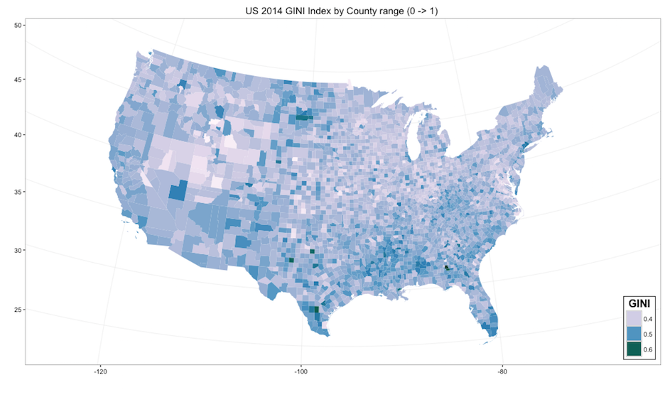
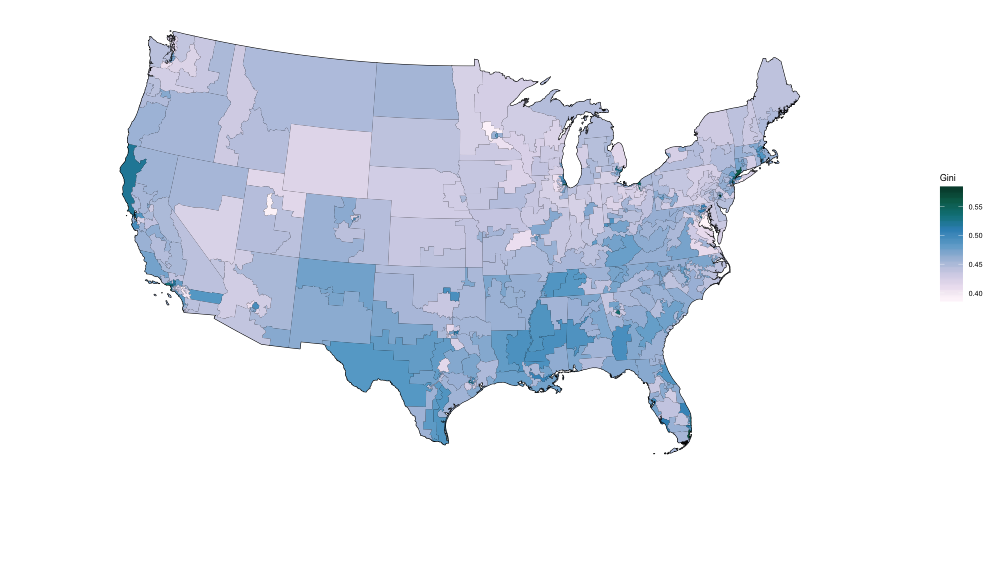

# Inequality and the Fallacy of Composition


##Demystifying inequality
Income inequality has become a topical discussion in recent years as matters of growth and social welfare of countries receive 
greater scrutiny.  Globalization and its relationship to wealth and poverty concentration underlies much of this heightened interest 
in income dispersion.  Before drawing inferences regarding this phenonomenon, its is helpful to first provide context by looking
at research in the area and doing a bit of data analysis.

Lets start with how income inequality is commonly measured by economists.  The GINI coefficient is an internationally recognized measure 
of income dispersion which is widely used by economists and social scientists.  It was developed as a ratio of idealized "perfect" to 
"observed" equality and graphically is illustrated by the difference in area between these curves to the area under the ideal curve.  The 
GINI ratio is derived from the Lorenz curve developed by Max O. Lorenz in 1905 for representing inequality of the wealth distribution. 

This fundamental model seems to be a good fit for analysis of variance modeling but visualizing this distribution perhaps is a more compelling 
way to convey what is happening between and within countries.

https://en.wikipedia.org/wiki/Lorenz_curve

##The Lorenz Curve

```r
# an simple example of the Lorenz curve model
bndry <- c( A=137, B=499, C=311, D=173, E=219, F=81)
bndry <- Lc(bndry, n = rep(1,length(bndry)), plot =F)
plot(bndry,col="black",lty=1,lwd=3,main="Lorenz Curve",xlab="Cum % of population", ylab="Cum % of income")
```

<!-- -->

##Fallacy of Composition
A misperception that what is true for the part is necessarily true for the whole.

In the context of inequality what is true within countries over time is not necessarily true between countries.
By analyzing representative countries this study provides a visualization of this distinction.  

Inferences can then be drawn from this analysis to give us a narrative as to what is happening with inequality.

##Cavaets regarding data and resuable code
This study references "Parametric Estimations of the World Distribution of Income"
Maxim Pinkovskiy, Massachusetts Institute of Technology
Xavier Sala-i-Martin, Columbia University and NBER1 Oct 11, 2009

Global and India data sets and shape files were sourced from the World Bank.  Many data sets that would be needed to
make this a more complete analysis was not available--at least publically.  Missing data is therefore noted and due to 
processing and time contraints required to render shapefiles, we show pre-rendered maps as png files, thus the code 
is not completely reproducable.

US data sets and shape files were sourced from the US Census Bureau

##Decreasing inequality between countries
Global trends actually show a decrease in inequality between countries over the past 40 years as Non-OECD
countries develop economically to parity with OECD countries.  Where the inequality is increasing within
many developing countries as concentrations of wealth grow where there had been widespread poverty.
[6 myths - Sali-Martin](https://www.youtube.com/watch?v=W17A-jiyDCw)  

## Global income inequality is dimiinishing 
 
 
[Maxim Pinkovskiy & Xavier Sala-i-Martin 2009] 

##Global Analysis from the World Bank
We download worldbank data and subset it so that it will include GINI coefficients only for 1981 and 2013. 
Because the GINI coefficient for 2005 for India is missing, the idea of the previous chunk was to scrape the 
urban and rural GINI coefficients for India and compute the weighted GINI coefficient and replace the NA for 
2005 for India with that value.


##GINI Between Countries - World Map 1981

```r
mapCountryData(n, nameColumnToPlot='1981GINI', mapTitle = "1981")
```

<!-- -->

##GINI Between Countries - World Map 2013

```r
mapCountryData(n, nameColumnToPlot= '2013GINI', mapTitle = "2013")
```

<!-- -->

##India
The provincial data for the GINI coefficient of India is scraped as follows and then spread out. Some of the spellings of the names of the provinces have to be changed so that they will match the names listed in the shape file. 
[worldbankdata](http://databank.worldbank.org/data/reports.aspx?Code=SI.POV.GINI&id=af3ce82b&report_name=Popular_indicators&populartype=series&ispopular=y) 
[stackexchange-ref](http://gis.stackexchange.com/questions/102781/chloropeth-map-in-r-data-on-map-not-represented-as-in-listed-in-the-file)

```r
dat.india.province = subset(fromJSON("https://knoema.com/api/1.0/data/wiwuiff?Time=2005-2005&region=1000130,1000020,1000040,1000050,1000060,1000080,1000090,1000100,1000110,1000120,1000140,1000150,1000160,1000220,1000210,1000230,1000290,1000280,1000270,1000250&variable=1000130,1000140,1000070,1000080&Frequencies=A")$data, select = -c(Unit, Time, RegionId, Frequency, Scale))
dat.india.province = data.frame(spread(dat.india.province, variable, Value))
colnames(dat.india.province)[2:5] = c("Ruralization (Percentage)", "Urbanization (Percentage)", "RuralGini", "UrbanGini")
dat.india.province$region[8] = "Jammu and Kashmir"
dat.india.province$region[14] = "Odisha"
```

Because this dataset does not include any information for Telangana, which was formed only recently, we can just subset the data so that we get data only for the province of Andhra Pradesh and just apply it to Telangana and then order the states in alphabetic order.

```r
dat.telangana = data.frame(region = 'Telangana', subset(dat.india.province, region == "Andhra Pradesh", select = -c(region)))
colnames(dat.telangana) = colnames(dat.india.province)
dat.india.province = rbind(dat.india.province, dat.telangana)
dat.india.province = dat.india.province[order(dat.india.province$region),]
```

Now, for each province, we compute the GINI coefficient by weighting the rural GINI coefficient with the percentage of the rural population and the urban GINI coefficient with the percentage of the urban population.

```r
dat.india.province$GINI = ((dat.india.province$RuralGini)*(dat.india.province$Ruralization) + (dat.india.province$UrbanGini)*(dat.india.province$Urbanization))/100
```

Now, we read in the shapefile for India and plot the map of India and color each province according to its GINI coefficient. 

```r
gpclibPermit()
gpclibPermitStatus()
map.ind.regions1 = readShapePoly("/Users/chittampalliyashaswini/Desktop/Yadu/IND_adm_shp/IND_adm1.shp", proj4string=CRS("+proj=longlat +datum=NAD27"))
map.ind.regions1 = fortify(map.ind.regions1, region = "NAME_1")
map.ind.regions1 = rename(map.ind.regions1,x=long,y=lat)

mycolors = brewer.pal(9,"BrBG")
plot1 = ggplot(data=dat.india.province) + geom_map(aes(fill=GINI, map_id=region),map=map.ind.regions1) + expand_limits(map.ind.regions1) + coord_map("polyconic") + theme_bw() + scale_fill_gradientn(name="GINI", colours = mycolors) + theme(legend.justification=c(1,0),legend.position=c(1,0),legend.background=element_rect(colour="black"))

mycolors2 = brewer.pal(9,"OrRd")
plot2 = ggplot(data=dat.india.provincecomp) + geom_map(aes(fill=`Rural Gini Coefficient Percent Change`, map_id=region),map=map.ind.regions1) + expand_limits(map.ind.regions1) + coord_map("polyconic") + theme_bw() + scale_fill_gradientn(name="Rural GINI % Change", colours = mycolors) + theme(legend.justification=c(1,0),legend.position=c(1,0),legend.background=element_rect(colour="black"))

mycolors3 = brewer.pal(9,"Blues")
plot3 = ggplot(data=dat.india.provincecomp) + geom_map(aes(fill=`Urban Gini Coefficient Percent Change`, map_id=region),map=map.ind.regions1) + expand_limits(map.ind.regions1) + coord_map("polyconic") + theme_bw() + scale_fill_gradientn(name="Urban GINI % Change", colours = mycolors) + theme(legend.justification=c(1,0),legend.position=c(1,0),legend.background=element_rect(colour="black"))

grid.arrange(plot1, plot2, plot3, top = textGrob("Maps of India", gp = gpar(fontface = "bold")), ncol = 1, nrow = 3)
```


## ggplot mapping GINI data to India's Provinces

```r
gi <- ggplot(data=dat.india.province) +
      scale_fill_gradientn(name="Coverage", colours = mycolors)
gi <- gi + geom_map(
                map=map.ind.regions1,
                aes(fill=GINI, map_id=region)
  ) +
  expand_limits(map.ind.regions1) +
  theme_bw()
gi <- gi + coord_map("polyconic") +
      labs(title="India 2005 GINI Index by Province range (0 -> 1) ",x="",y="") +
      theme_bw() +
      theme(legend.justification=c(1,0),legend.position=c(1,0),
            legend.background=element_rect(colour="black"))
gi <- gi + guides(fill=guide_legend(title="GINI",nrow=3,title.position="top",
                title.hjust=0.5,title.theme=element_text(face="bold",angle=0)))
gi <- gi + scale_x_continuous("") + scale_y_continuous("")
gi 
```

##India GINI 2005 map by Province
 

##India GINI% Change 1974 - 2005 Urbanization
 

##India GINI% Change 1974 - 2005 Ruralization
 

##India Urbanization Regression Analysis

```r
ggplot(dat.india.province, aes(x = `Urbanization (Percentage)`, y = GINI)) + geom_point(color = "red") + geom_smooth(method = "lm")
```

<!-- -->

```r
lm(GINI ~ `Urbanization (Percentage)`, data = dat.india.province)
```

```
## 
## Call:
## lm(formula = GINI ~ `Urbanization (Percentage)`, data = dat.india.province)
## 
## Coefficients:
##                 (Intercept)  `Urbanization (Percentage)`  
##                    0.037315                     0.006261
```

```r
summary(lm(GINI ~ `Urbanization (Percentage)`, data = dat.india.province))
```

```
## 
## Call:
## lm(formula = GINI ~ `Urbanization (Percentage)`, data = dat.india.province)
## 
## Residuals:
##       Min        1Q    Median        3Q       Max 
## -0.055301 -0.019227 -0.003567  0.023605  0.066789 
## 
## Coefficients:
##                              Estimate Std. Error t value Pr(>|t|)    
## (Intercept)                 0.0373150  0.0204036   1.829   0.0832 .  
## `Urbanization (Percentage)` 0.0062608  0.0007829   7.997 1.69e-07 ***
## ---
## Signif. codes:  0 '***' 0.001 '**' 0.01 '*' 0.05 '.' 0.1 ' ' 1
## 
## Residual standard error: 0.03048 on 19 degrees of freedom
## Multiple R-squared:  0.7709,	Adjusted R-squared:  0.7589 
## F-statistic: 63.95 on 1 and 19 DF,  p-value: 1.686e-07
```

##India Ruralization Regression Analysis

```r
ggplot(dat.india.province, aes(x=`Ruralization (Percentage)`,y=GINI)) + geom_point(color="red") + geom_smooth(method= "lm") 
```

<!-- -->

```r
lm(GINI ~ `Ruralization (Percentage)`, data = dat.india.province)
```

```
## 
## Call:
## lm(formula = GINI ~ `Ruralization (Percentage)`, data = dat.india.province)
## 
## Coefficients:
##                 (Intercept)  `Ruralization (Percentage)`  
##                    0.023372                     0.004427
```

```r
summary(lm(GINI ~ `Ruralization (Percentage)`, data = dat.india.province))
```

```
## 
## Call:
## lm(formula = GINI ~ `Ruralization (Percentage)`, data = dat.india.province)
## 
## Residuals:
##       Min        1Q    Median        3Q       Max 
## -0.055002 -0.014365  0.007769  0.014592  0.037581 
## 
## Coefficients:
##                              Estimate Std. Error t value Pr(>|t|)    
## (Intercept)                 0.0233720  0.0187340   1.248    0.227    
## `Ruralization (Percentage)` 0.0044273  0.0004687   9.446 1.31e-08 ***
## ---
## Signif. codes:  0 '***' 0.001 '**' 0.01 '*' 0.05 '.' 0.1 ' ' 1
## 
## Residual standard error: 0.02668 on 19 degrees of freedom
## Multiple R-squared:  0.8244,	Adjusted R-squared:  0.8152 
## F-statistic: 89.23 on 1 and 19 DF,  p-value: 1.308e-08
```


##The United States, as a representative OECD country and its pattern of income inequality.
The Census Bureau publishes data sets which track the GINI index at different levels of geographic granularity including 
region, state, congressional district and metropolitan statical area.  This study analyzes the income dispersion within the 
United States using Census data and in particular, income data collected for the American Community Survey.  The Census Bureau 
provides the followng tool for acquiring data sets . . .

http://factfinder.census.gov/faces/nav/jsf/pages/guided_search.xhtml

##United States Analysis
This is an observational study of data collected by surveyors by the US Census Bureau.  The presumption is that each observation 
is an independent event of objective fact.  The Census Bureau's survey techniques rely sampling, so the initial data-set is based 
to a degree on statiscial inference and imputed data. 

##Boundary Conditions
All data used in this survey was sourced from the American Community Survey published by the US Census Bureau.  4 distinct 
datasets generated using the Census Bureau's utility.  Except for the Regional data set all other data sets have more than 
30 independent observations.  It is therefore expected that a near normal sampling distribution applies to the data collected. 
    
    *   50 States
    *  436 Congressional Districts
    *  916 Gini Indicies by Metropolitan Statistical Area 
    * 3143 Counties
    
##US GINI Between States
 

##US GINI Between Counties 



## Urbanization correlation

```r
attach(US.counties)
plot(disttocity, GINI, main="Scatterplot Example", xlab="DIST ", ylab="GINI ", pch=19)
abline(lm(GINI~disttocity), col="red") # regression line (y~x) 
```

<!-- -->

```r
summary(lm(GINI ~ `disttocity`, data = US.counties))
```

```
## 
## Call:
## lm(formula = GINI ~ disttocity, data = US.counties)
## 
## Residuals:
##       Min        1Q    Median        3Q       Max 
## -0.105120 -0.022189 -0.002359  0.019996  0.212999 
## 
## Coefficients:
##              Estimate Std. Error t value Pr(>|t|)    
## (Intercept)  0.440769   0.001076 409.449   <2e-16 ***
## disttocity  -0.001414   0.001083  -1.306    0.192    
## ---
## Signif. codes:  0 '***' 0.001 '**' 0.01 '*' 0.05 '.' 0.1 ' ' 1
## 
## Residual standard error: 0.034 on 2968 degrees of freedom
## Multiple R-squared:  0.0005744,	Adjusted R-squared:  0.0002377 
## F-statistic: 1.706 on 1 and 2968 DF,  p-value: 0.1916
```

##Congressional Districts (Political Boundaries) 


##Metropolitan Statistical Areas (Economic Boundaries)
[MSA](http://www.citylab.com/politics/2014/08/where-the-great-recession-made-inequality-worse/375480/)
